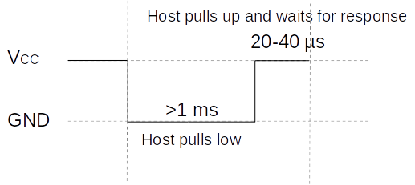
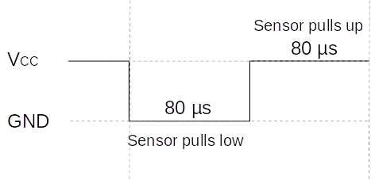
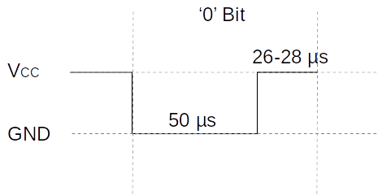
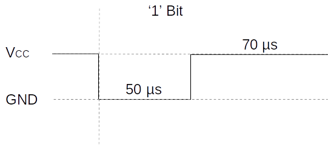

# DHT22 Sensor Library for ATmega328P

This repository contains the code for interfacing a DHT22 sensor with an ATmega328P microcontroller. The DHT22 sensor is a temperature and humidity sensor that communicates over a single-wire digital interface. The ATmega328P is a popular microcontroller used in Arduino boards.

### Libraries Used
The code makes use of the following libraries:

- `avr/io.h`: Standard AVR I/O definitions.
- `util/delay.h`: Functions to provide short delays.

### Usage

1. Include the necessary libraries at the beginning of your code.
2. Declare variables for temperature and humidity (e.g., `float humidity, float temperature;`).
3. Call `read_DHT22(&humidity, &temperature)` to obtain temperature and humidity values (in °C and %).
4. Check the return value from  `read_DHT22(&humidity, &temperature)` for errors.
	- `0` : Reading successful.
	- `-1`: Sensor not detected.
	- `-2`: Timeout during data transmission.
	- `-3`: Data integrity check failed.
	- `-4`: Temperature out of range.
	- `-5`: Humidity out of range.
5. The Datapin is preset to pin PB5 and can be changed in the DHT22.h
	```c 
	#define DHT22_DDR  		DDRB   // Set Data Direction Register
	#define DHT22_PORT 		PORTB  // Set Port
	#define DHT22_INPUT		PINB   // Read Pin
	#define DHT22_PIN 		PORTB5 // DHT22 Input Pin
	```
6. The interval between two measurements must be at least 2s.
### 1-Wire Bus

The DHT22 utilizes a 1-wire bus for communication. It is important to note that this 1-wire bus differs from the 1-wire bus used by Dallas, and they are not compatible with each other.

#### Communication and signal

The communication takes place in 3 steps:

1. **Start Signal (1 ms) an wait for response**

	
	
2. **Response**

	
	
3. **40-Bit Data Transmission**
	
	- **'0' Bit**

	 

	- **'1' Bit**

   
	 
	
	- **Data**

		**Bit 0-7**: Humidity high
	
		**Bit 8-15**: Humidity low
   
		**Bit 16-23**: Temperature high

		**Bit 24-32**: Temperature low

		**Bit 33-40**: Checksum

	- Humidity and temperatures are each composed of 2 bytes each (high and low).
	- They will output the value x10 (234 = 23,4°C).
	- The temperature is negative if the MSB bit from the temperature high byte is '1'.
	- The checksum is calculated as the sum of the other four bytes, considering only the least significant 8 bits of the sum.

